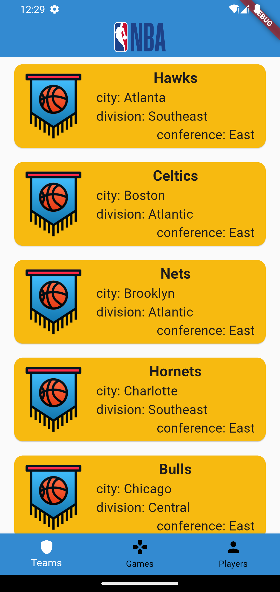
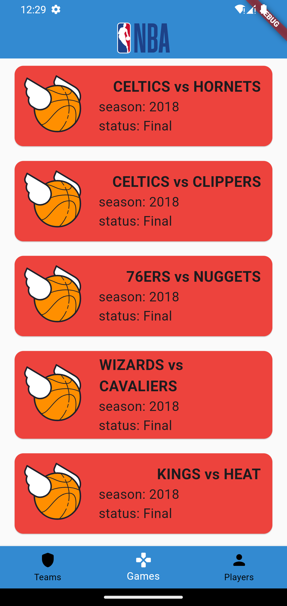
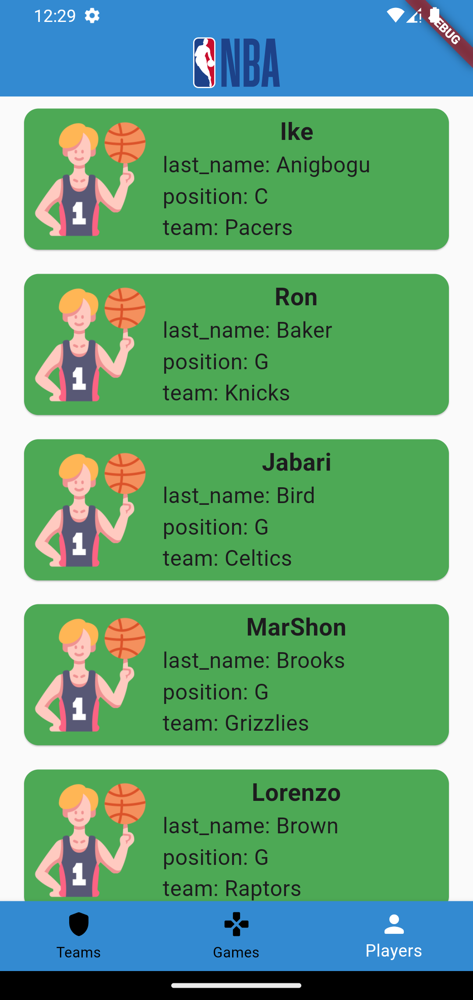

# NBA | API
Proyecto flutter enfocado en consumir la API pública basada en la NBA para obtener información sobre equipos, jugadores y juegos. Se han implementado tres endpoints: `teams`, `players` y `games`. Para cada uno de estos endpoints, se ha creado una pestaña en una barra de navegación inferior para facilitar la navegación.
## Capturas de pantalla
| Teams | Games | Players |
| :---: | :---: |:---: |
||||

## Estrucutra del proyecto
El proyecto se estructura de la siguiente manera:
- **`assets`**: Almacena los recursos estáticos esenciales de la aplicación
- **`lib`**: Contiene todo el código fuente de la aplicación.
  - **`main.dart`**: Este archivo sirve como el punto de entrada principal de la aplicación.
  - **`src`**: En esta subcarpeta se agrupa la lógica principal de la aplicación.
    - **`app.dart`**: Contiene la estructura y configuración central de la aplicación.
    - **`api`**: Aquí se encuentra la lógica para interactuar con la API externa.
    - **`pages`**: Almacena las diferentes páginas de la aplicación
    - **`widgets`**: Contiene widgets reutilizables utilizados en las páginas de la aplicación
## Librerías Utilizadas

- [**http**](https://pub.dev/packages/http): Para realizar solicitudes HTTP a la API de la NBA. 

- [**flutter_svg**](https://pub.dev/packages/flutter_svg): soporte para SVG.

## Recursos
- [**API**](https://www.balldontlie.io/home.html#introduction): Documentación de la API utilizada.